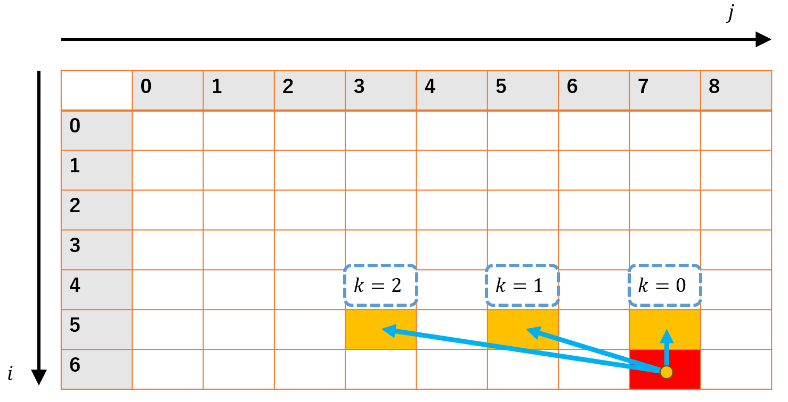
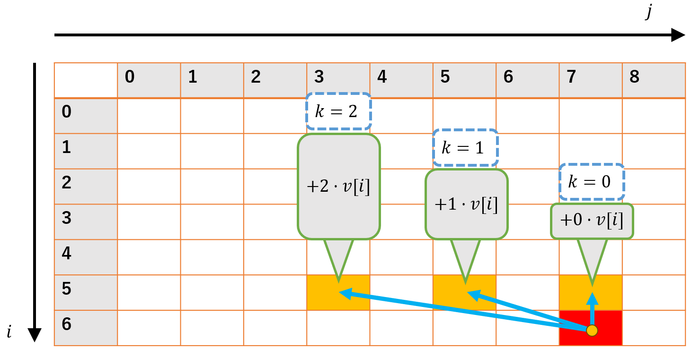

+++
title = '個数制約付きナップサック問題を部分和数え上げから自然に理解する'
date = 2023-10-07T12:33:06+09:00
tags = ['DP', '競技プログラミング']
+++
## はじめに

個数制約付きナップサック問題のスライド最小値を使う解法は、テクい部分が多かったりして、初見だと「なんだこの式変形！？」などとなりがちなのではないかと思っています。

これに対し、導入として個数制約付き部分和数え上げ問題の話をすることで理解が少し簡単になるのではないかと思っており、これについて書いてみます。

対象読者としては、緑～青くらいの人かなと思います。

<!--more-->

なお、普通の01-ナップサック問題に加え、スライド最小値、あるいはSWAGというデータ構造は既知であるものとして話を進めます。

（内部構造がわかっている必要はないです。Queueでできる操作に加えて今入っている要素のminやmaxなどを$O(1)$でとれるデータ構造が存在するよ、ということが分かっていればOKです。
[分かりやすいSWAGの解説記事](https://motsu-xe.hatenablog.com/entry/2019/12/06/192424)）

## 考える問題

対象となるのは次のような問題です[AOJ Course DPL_1_G](https://judge.u-aizu.ac.jp/onlinejudge/description.jsp?id=DPL_1_G&lang=ja)

​	品物が$N$種類ある。各品物の価値$v[i]$、重さ$w[i]$、個数$m[i]$が与えられるので、重さの合計が$W$以下になるよう選んだ時の価値の合計の最大値を求めよ。(TL 1 sec.)

- 品物の種類$N≤100$
- 価値$v[i]\leq1000$
- 重さ$w[i]\leq1000$
- 各品物の個数$m[i]≤10000$
- 選べる重さの最大値$W$

これを時間計算量$O(NW)$で解くことがこの記事の目標となります。

## 個数制約付き部分和数え上げ

いきなり本筋の問題について考える前に、次のような問題を考えます。

品物が$N$種類ある。各品物の重さ$w[i]$、個数$m[i]$が与えられるので、重さの合計が$W$になるような選び方を数え上げよ。ただし、**同じ品物は区別しないもの**とする。(TL 1 sec.)

選び方が異なる=ある品物について選んだ個数が異なる

制約

- 品物の種類$N≤100$
- 各品物の重さ$w[i]\leq1000$
- 各品物の個数$m[i]≤10000$
- 選べる和$W≤10000$


元の問題とは違い、価値を考えなくていい代わりに数え上げ問題になっています。

普通のナップサックDPと同じようにやろうとすると、次のような感じで

$$
dp[i][j] = i番目までの品物だけを考え、重さjになる選び方
$$

とするのが思いつきますが。これを素直にやってしまうと各$dp[i][j]$を求めるのに$O(m[i])$かかるので、トータルで$O(NW\max(m[i]))$かかり、TLEしてしまいます。

疑似コードは次のような感じ

```cpp
dp[0][0] = 1;
for (int i = 1; i <= N; ++i) {
    for (int j = 0; j <= W; ++j) {
        for (int k = 0; k <= m[i]; ++k) {
            dp[i][j] += dp[i - 1][j - w[i] * k];
        }
    }
}
```

この遷移をよく見ると、$j$の部分は$\bmod w[i]$ごとに独立になっていることがわかります。

例えば、下の図は$v[6]=2,w[6]=2$の時に$dp[6][7]$の値を求める様子をイメージしたものですが、$j％2==1$になる要素直近3つ（$=v[6]+1$個）の和を求めていることが分かります。



これを利用すると次のように、for文を$w[i]$の余りで回し、さらにQueueを使って直前$m[i]+1$項とその和を保存しておくことで$O(NW)$で解くことができるようになります。

```cpp
dp[0][0] = 1;
for (int i = 1; i <= N; ++i) {
    for (int amari = 0; amari < w[i]; amari += w[i]) {
        // mod w[i]でm[i]個前まで
        //    (dp[i - 1][j - m[i] * w[i]], ..., dp[i - 1][j - w[i]], dp[i - 1][j])
        // を格納するキューとその合計
        queue<mint> que;
        mint queSum;
        for (int j = amari; j <= W; j += w[i]) {  // j%w[i]がamariになるものだけループ
            que.push(dp[i - 1][j]);
            queSum += dp[i - 1][j];
            if (dq.size() > k + 1) {
                queSum -= que.front();
                que.pop();
            }
            dp[i][j] = queSum;
        }
    }
}
```

（今回は取り上げませんが、数え上げでなく単に部分和を列挙するだけの場合、蟻本にあるように個数を2冪に分解する方法が使えます。logが付いてしまいますが、こちらはbitset高速化が効きます。）

## 改めてナップサックで考える

先ほどの部分和の例と同じように考えてみます。まずはナイーブなDPを考えると、

$$
dp[i][j] = i番目の品物までを考えて重さjになるよう選んだ時の価値の最大値
$$

のように考え、次のような処理をすることになります。

```cpp
// テーブルは0初期化されているとする
for (int i = 1; i <= N; ++i) {
    for (int j = 0; j <= W; ++j) {
        for (int k = 0; k <= m[i]; ++k) {
            dp[i][j] = max(dp[i][j], dp[i - 1][j - w[i] * k] + v[i] * k);
        }
    }
}
```

コードはさっきのTLE解法のものにかなり近く、パッと見AC解法のQueueの部分をスライド最小値に変えてやることで解けるのでは？と思えます。

しかし、$\bmod w[i]$ごとに独立という性質は先ほどの例と同じであるものの、$+v[i]\cdot k$という部分が余計についているのが邪魔で、単に$\bmod w[i]$で$k$個前までのmaxを取るだけではいけません。



そこで、恣意的にDPテーブルの定義を変えてやることで無理やり「$\bmod w[i]$で$k$個前までのmaxを取るだけ」な状態にすることができないか考えます。

結論としては、参照する要素ごとに$v[i]$ずつ足す値がずれていくのでそれと相殺するために、
$$
dp2[i][j’\cdot w[i]+a] = dp[i][j’\cdot w[i] + a] - j’ \cdot v[i]
$$

というように値を$v[i]$ずつずらしたDPテーブルを考えることで、いい感じに余計な項が消えてくれます。（$a$は部分和の時のコードで言う変数amari。$j=j'\cdot w[i] + a$としています）

遷移の時の具体的な計算は、

```
dp2[i][j' * w[i] + a] = max(dp2[i - 1][j'          * w[i] + a], 
                            dp2[i - 1][(j' - 1)    * w[i] + a], 
                            ..., 
                            dp2[i - 1][(j' - m[i]) * w[i] + a]) 
                         + j' * v[i];
```

のように、最後に余計な項が少し入るものの基本的にはk項前までのmaxを取るだけになります。


この形に持ち込めばmaxはスライド最大値やSWAG等を使うことで$O(1)$で計算でき、トータル$O(NW)$で問題を解くことができます。


実装としては次のような感じになります。（$j'\cdot w[i]+a=j$なので、$\lfloor \frac j {w[i]}\rfloor=j'$となります）

```cpp
for (int i = 1; i <= N; ++i) {
    for (int a = 0; a < w[i]; ++a) {
        SWAG<int, max> swag; // この中身がdp2
        for (int j = a; j <= W; j += w[i]) { // 実装が楽なのでj'でなくjでループを回しています
            swag.push(dp[i - 1][j] - j / w[i] * v[i]);
            if (swag.size() > m[i] + 1) {
                swag.pop();
            }
            dp[i][j] = swag.prod() + v[i] * (j / w[i]); // swag.prod() + v[i] * j'
        }
    }
}
```

## まとめ

個数制約付きナップサック問題を$O(NW)$で解く方法について書きました。

ポイントとしては以下の3つが重要ですが、部分和数え上げ問題は1だけ利用することで解けるので、そこから解こうとすると2,3が比較的自然な発想で出てくるのではないかと思います。

1. DP遷移が$\mod w[i]$で独立であることを利用する
2. 式変形で扱いやすい形式に持っていく
3. データ構造で高速化する

ACコードを載せておきます

```cpp
#include <bits/stdc++.h>
using namespace std;

template <typename T, T (*op)(T, T)>
struct SWAG {
    stack<T> st1, st2, raw;

    void push(T x) {
        if (st1.empty()) st1.push(x);
        else st1.push(op(st1.top(), x));
        raw.push(x);
    }

    void move() {
        if (st2.empty()) {
            while (!st1.empty()) {
                st1.pop();
                if (st2.empty()) st2.push(raw.top());
                else st2.push(op(raw.top(), st2.top()));
                raw.pop();
            }
        }
    }

    void pop() {
        move();
        st2.pop();
    }

    T prod() {
        if (st2.empty()) return st1.top();
        if (st1.empty()) return st2.top();
        return op(st2.top(), st1.top());
    }

    int size() { return st1.size() + st2.size(); }
};

int op(int a, int b) { return max(a, b); }

int main() {
    int N, W;
    cin >> N >> W;
    using T = tuple<int, int, int>;
    vector<T> items(N);
    for (int i = 0; i < N; ++i) {
        int vi, wi, mi;
        cin >> vi >> wi >> mi;
        items[i] = T(vi, wi, mi);
    }

    vector<vector<int>> dp = vector<vector<int>>(N + 1, vector<int>(W + 1));

    for (int i = 1; i <= N; ++i) {
        auto [vi, wi, mi] = items[i - 1];
        for (int a = 0; a < wi; ++a) {
            SWAG<int, op> swag;
            for (int j = a; j <= W; j += wi) {
                swag.push(dp[i - 1][j] - j / wi * vi);
                if (swag.size() > mi + 1) swag.pop();
                dp[i][j] = swag.prod() + vi * (j / wi);
            }
        }
    }
    cout << dp[N][W] << endl;
    return 0;
}
```