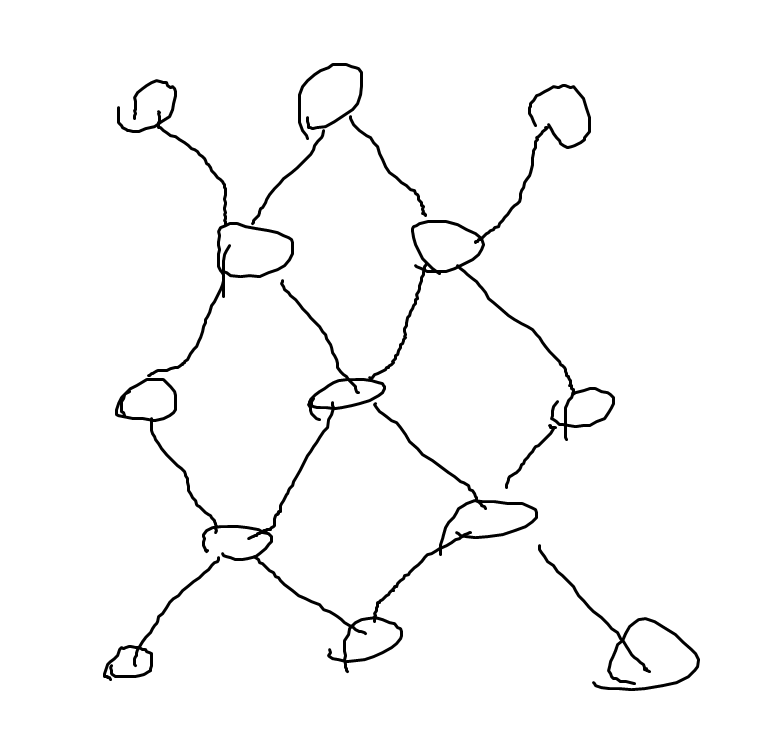

+++
title = "Codeforces 138D World of Darkraft"
date = 2025-03-04T13:53:04+09:00
tags = ['競技プログラミング', '蟻本練習問題']
+++

https://codeforces.com/problemset/problem/138/D

https://vjudge.net/problem/CodeForces-138D
<!--more-->
## 問題概要
- $N\times M$のグリッドが与えられ、これを使って2人のプレイヤーがゲームを行う。
- ゲーム開始時、各マスには `L,R,X` いずれかが書かれている。
- プレイヤーは各ターンに文字が書かれているマスを1つ選び、書かれている文字によって以下のことが起こる。
	- `L`：選ばれたマスと、そこから**左下・右上方向**の、フィールドの端か文字の書かれていないマスまでの経路上の文字をすべて消す
	- `R`：選ばれたマスと、そこから**左上・右下方向**の、フィールドの端か文字の書かれていないマスまでの経路上の文字をすべて消す
	- `X`：選ばれたマスと、そこから**左下・右上・左上・右下方向**の、フィールドの端か文字の書かれていないマスまでの経路上の文字をすべて消す
- 全てのマスの文字が消えた状態でターンが回ってきたプレイヤーは敗北する。
- 先手が勝つかどうか判定せよ
### 制約
- $1\leq N,M\leq20$

## 解法メモ
- 上から$i$番目、左から$j$番目のマスを$(i,j)$で表す。$(0\leq i< N, 0\leq j< M)$

- $i+j$が偶数のマスと奇数のマスは互いに関係ないので、独立に考えてよい

- そうすると以下のようなグラフが考えられる
- あるマスを選ぶことは斜め方向の頂点が消え、頂点数のより小さい1~4つの連結成分に分割されることだと言える

- グラフのGrundy数をメモ化再帰等で求めればよい
- いわゆる「盤面に分裂があるゲーム」なので、分裂後のそれぞれのグラフのgrundy数のxorを考えればOK



45度回転すると盤面を縦2つ or 横2つ or 縦横4つに分割すると考えられて実装しやすいと思う

## 実装例
`x = (i+j)/2, y = (j-i+n-1)/2` とするといい感じ
```cpp
#include <bits/stdc++.h>
#define rep(i, n) for (int i = 0, i##_len = (n); i < i##_len; ++i)
#define all(v) begin(v), end(v)
constexpr int inf = 1e9;
using namespace std;

char rotate(char c) {  // LRXだとわかりづらいので回転後の方向に変換
    if (c == 'L') return '-';
    if (c == 'R') return '|';
    return '+';
}
int mex(vector<int> &nxt) {
    sort(all(nxt));
    nxt.erase(unique(all(nxt)), nxt.end());
    rep(i, nxt.size()) if (nxt[i] != i) return i;
    return nxt.size();
}

// 45度回転後の盤面
char board_[2][20][20];

int memo[2][20][20][20][20];
int main() {
    ios_base::sync_with_stdio(false);
    cin.tie(NULL);
    int n, m;
    cin >> n >> m;

    vector<string> board(n);
    rep(i, n) cin >> board[i];

    // 45度回転してパリティで分ける
    // 変換後の区間
    int minX[2] = {inf, inf};
    int minY[2] = {inf, inf};
    int maxX[2] = {-inf, -inf};
    int maxY[2] = {-inf, -inf};
    rep(i, n) {
        rep(j, m) {
            int x = (i + j) / 2;
            int y = ((j - i) + (n - 1)) / 2;
            int parity = (i + j) % 2;
            board_[parity][x][y] = rotate(board[i][j]);
            minX[parity] = min(minX[parity], x);
            minY[parity] = min(minY[parity], y);
            maxX[parity] = max(maxX[parity], x);
            maxY[parity] = max(maxY[parity], y);
        }
    }

    auto rec = [&](auto rec, int minX, int maxX, int minY, int maxY, auto b, auto memo) -> int {
        if (minX > maxX || minY > maxY) return 0;
        if (memo[minX][maxX][minY][maxY] != -1) return memo[minX][maxX][minY][maxY];

        vector<int> next_grundy;
        for (int x = minX; x <= maxX; ++x) {
            for (int y = minY; y <= maxY; ++y) {
                if (!b[x][y]) continue;
                if (b[x][y] == '-') {  // 横一行を消して上下に分ける
                    int g1 = rec(rec, minX, x - 1, minY, maxY, b, memo);
                    int g2 = rec(rec, x + 1, maxX, minY, maxY, b, memo);
                    next_grundy.push_back(g1 ^ g2);
                } else if (b[x][y] == '|') {  // 縦一列を消して左右に分ける
                    int g1 = rec(rec, minX, maxX, minY, y - 1, b, memo);
                    int g2 = rec(rec, minX, maxX, y + 1, maxY, b, memo);
                    next_grundy.push_back(g1 ^ g2);
                } else if (b[x][y] == '+') {  // 十字に消して4つに分ける
                    int g1 = rec(rec, minX, x - 1, minY, y - 1, b, memo);
                    int g2 = rec(rec, x + 1, maxX, y + 1, maxY, b, memo);
                    int g3 = rec(rec, x + 1, maxX, minY, y - 1, b, memo);
                    int g4 = rec(rec, minX, x - 1, y + 1, maxY, b, memo);
                    next_grundy.push_back(g1 ^ g2 ^ g3 ^ g4);
                }
            }
        }

        return memo[minX][maxX][minY][maxY] = mex(next_grundy);
    };

    int grundy = 0;
    memset(memo, -1, sizeof(memo));  // -1で初期化
    rep(parity, 2) { grundy ^= rec(rec, minX[parity], maxX[parity], minY[parity], maxY[parity], board_[parity], memo[parity]); }

    cout << (grundy ? "WIN" : "LOSE") << endl;
}
```