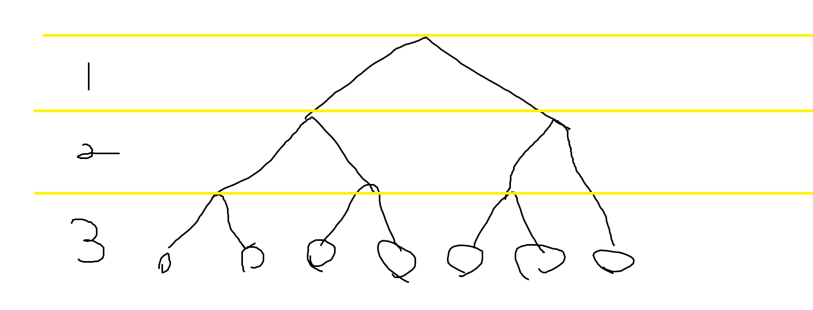

+++
title = "Codeforces 97B Superset"
date = 2025-03-04T13:53:08+09:00
tags = ['競技プログラミング', '蟻本練習問題']
+++

https://codeforces.com/problemset/problem/97/B

https://vjudge.net/problem/CodeForces-97B
<!--more-->
## 問題概要
- 平面上の点の集合は、任意の2点が以下のいずれかの条件を満たすとき、良い集合である
	- $x$座標が同じ
	- $y$座標が同じ
	- 2つの点を頂点とする長方形を考えた時、内側または境界上に2点以外の点が少なくとも1つ含まれる

- $n$個の点からなる集合$S$が与えられる。$S$の良い上位集合$T$で、サイズが$2\times10^5$を超えないものを構築せよ
	- （上位集合は部分集合の逆。$S\subseteq T$となる$T$のうち良い集合であるものを構築する）
### 制約
- $1\leq n \leq 10^4$
- $-10^9\leq x_i,y_i\leq 10^9$

## 解法メモ
- $T$の最大要素数が$2\times10^5$で、$|S|$の20倍程度使っていい
- 分割統治で再帰一段ごとに$|S|$個程度の点を追加すれば解けそうな気がする


- まず、$x=x_c$で点の数が半分になるよう区切る（点を$x$座標でソートした時、$|S|/2$番目の点の$x$座標を$x_c$とする）
- 左領域、右領域に属す点集合が何らかの方法で「良い集合」になったとする
- このとき、左右領域合わせた時に「良い集合」であるためには、左領域から1つ、右領域から1つ点を取ってきたときにどのペアも条件を満たす必要がある
- この条件を満たすように点を追加すればよい


- 各点$(x_i,y_i)$について、同じ$y$座標の点$(x_c, y_i)$を追加していけば、$(x_i,y_i)$を頂点とする、左右領域から点を1つずつ取る長方形を考えた時に必ずこの点が入るため、条件を満たすようになる


- あとはこの追加の仕方で要素数$2\times10^5$以下になることを示せばよい
- このような再帰関数を考えた時、深さは最大で$\left\lceil\log_2 10^4\right\rceil=14$段である
- ひとつ前のステップで追加した点はもとから$S$に存在するある点と同じ座標になるので、再帰一段ごとに最大$|S|-1$個の点を追加することになり、十分$2\times10^5$個に収まる

## 実装例
```cpp
#include <bits/stdc++.h>
#define rep(i, n) for (int i = 0, i##_len = (n); i < i##_len; ++i)
#define rep2(i, s, n) for (int i = (s); i < (int)(n); i++)
#define all(v) begin(v), end(v)
using namespace std;

int main() {
    ios_base::sync_with_stdio(false);
    cin.tie(NULL);
    int n;
    cin >> n;
    using P = pair<int, int>;
    vector<P> points(n);
    rep(i, n) { cin >> points[i].first >> points[i].second; }

    set<P> ans(all(points));

    sort(all(points));
    auto rec = [&](auto rec, int l, int r) -> void {
        if (r - l <= 1) return;
        int m = (l + r) / 2;
        rec(rec, l, m);
        rec(rec, m, r);

        int x0 = points[m].first;
        for (int i = l; i < r; ++i) {
            ans.insert({x0, points[i].second});
        }
    };
    rec(rec, 0, n);
    cout << ans.size() << endl;
    for (auto [x, y] : ans) {
        cout << x << " " << y << endl;
    }
}
```