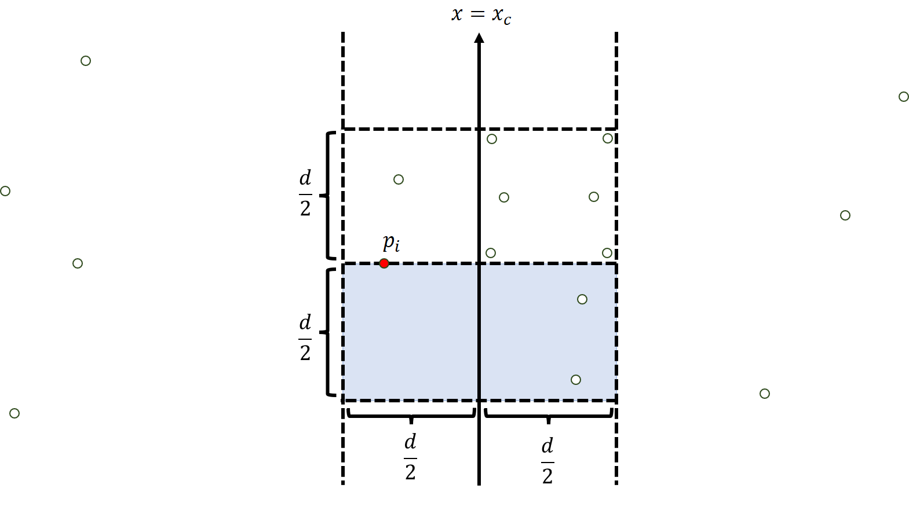
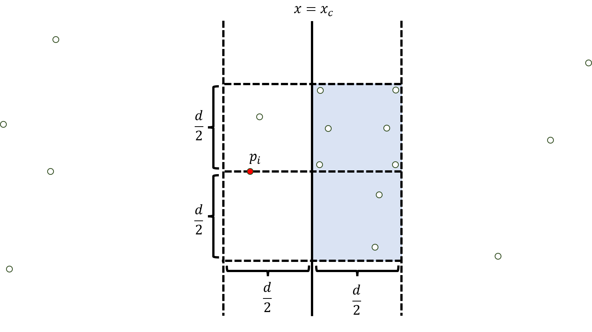

+++
title = "GCJ 2009 World Finals B Min Perimeter(BOJ 12611,12612,Gym 100240K)"
date = 2025-03-04T13:53:10+09:00
tags = ['競技プログラミング', '蟻本練習問題']
+++

https://www.acmicpc.net/problem/12611
https://www.acmicpc.net/problem/12612
https://codeforces.com/gym/100240/attachments

https://vjudge.net/problem/Gym-100240K
https://vjudge.net/problem/Baekjoon-12611
https://vjudge.net/problem/Baekjoon-12612
<!--more-->

## 問題概要
- 整数座標を持つ平面上の点の集合が与えられる。
- 3つの異なる点を選んで得られる三角形の周長のうち、最小のものを求めよ
- 三角形は退化していてもよい（面積0でもよい）
### 制約
- テストケース数$1\leq T\leq 15$
- 座標$0\leq x_i,y_i\leq 10^9$
- 点の個数$3\leq n\leq 10^6$

TLはGymで30秒、BOJで90秒と長め
## 解法メモ
- まず、同じ座標に3点以上ある場合はそれを選べば0になるので、同じ座標に点は最大2つまでしか重ならない。

- 分割統治する
- ある$x_c$で左側と右側に区切ると、点の選び方は
	- 左領域から3つ選ぶ
	- 右領域から3つ選ぶ
	- 左から1つ、右から2つ選ぶ
	- 右から1つ、左から2つ選ぶ
- の4通りになる。上2つだけ考えた時の最小値が$d$とし、下2つを考える

- 三角形の中で最も$Y$座標が大きい点$p_i$を全探索することにする
- 三角形のうち少なくとも1つの点は$x=x_c$の直線の向かい側にあるので、直線から$\dfrac d2$以上の点を選んでしまうとそれだけで周長が$d$を超えてしまう。このような点は無視していい。

- また、残り2つの点については、$x=x_c$からの距離が$\dfrac d2$未満の点の中で、点$p_i$との$y$座標の差も$\dfrac d2$であるものから選ぶ必要がある。(図の水色の領域）

- $\dfrac d2 \times \dfrac d2$の正方形領域の中の点は少ないため候補は少なく、全探索することができる
	- 個数については未証明だが、多いと中で周長$d$未満の三角形ができてしまうため、多くはならない
		- [正方形2つで点16個が可能らしい](https://zibada.guru/gcj/2009wf/problems/#analysis-B)が証明を見つけられず



- 最初、$p_i$が$y$座標最大であるという条件を付けないで↓の領域を探索しようとしたが、実装が面倒になるためやめた


## 実装例
蟻本の最近点対のコードにかなり近い

```cpp
#include <bits/stdc++.h>
#define rep(i, n) for (int i = 0, i##_len = (n); i < i##_len; ++i)
#define rrep(i, n) for (int i = ((int)(n)-1); i >= 0; --i)
#define all(v) begin(v), end(v)
using namespace std;

constexpr double inf = 1e14;

struct Point {
    double x, y;
};

double _minPerimeter(vector<Point>& ps, int l, int r) {
    const int n = r - l;
    if (n < 3) return inf;  // 点が最低3つなければ三角形は作れないのでreturn
    int m = n / 2;
    double xc = ps[l + m].x;
    double d = min(_minPerimeter(ps, l, l + m), _minPerimeter(ps, l + m, r));

    // y座標でソート
    inplace_merge(ps.begin() + l, ps.begin() + l + m, ps.begin() + r,
                  [](const Point& a, const Point& b) { return a.y < b.y; });
    vector<Point> b;
    rep(i, n) {  // y座標最大の点を固定
        Point p1 = ps[l + i];
        if (abs(p1.x - xc) >= d / 2) continue;  // x=xcからd/2以上離れている点は無視

        rrep(j, b.size()) {  // 2つ目の点
            Point p2 = b[j];
            double dx12 = p1.x - p2.x, dy12 = p1.y - p2.y;
            if (dy12 >= d / 2) break;
            rrep(k, j) {  // 3つ目の点
                Point p3 = b[k];
                double dx13 = p1.x - p3.x, dy13 = p1.y - p3.y;
                double dx23 = p2.x - p3.x, dy23 = p2.y - p3.y;
                if (dy13 >= d / 2) break;
                d = min(d, sqrt(dx12 * dx12 + dy12 * dy12) + sqrt(dx23 * dx23 + dy23 * dy23) +
                               sqrt(dx13 * dx13 + dy13 * dy13));
            }
        }
        b.push_back(p1);
    }
    return d;
}
double minPerimeter(const vector<Point>& ps) {
    vector<Point> qs = ps;
    // x座標でソート
    sort(all(qs), [](const Point& a, const Point& b) { return a.x < b.x; });
    return _minPerimeter(qs, 0, qs.size());
}

int main() {
    ios_base::sync_with_stdio(false);
    cin.tie(NULL);
    int Q;
    cin >> Q;
    rep(t, Q) {
        int n;
        cin >> n;
        vector<Point> ps(n);
        rep(i, n) cin >> ps[i].x >> ps[i].y;
        cout << "Case #" << t + 1 << ": " << fixed << setprecision(20) << minPerimeter(ps) << endl;
    }
}
```