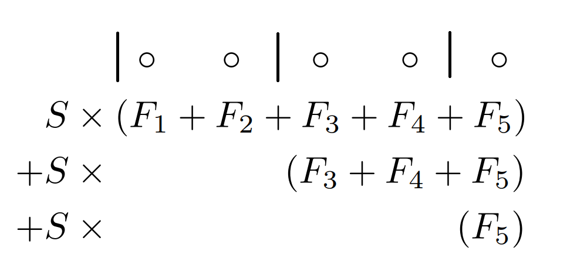
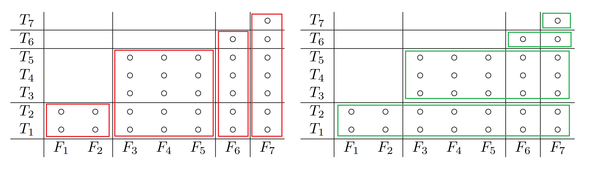

+++
title = "POJ 1180 Batch Scheduling(BOJ 5498, EOlymp 4144, DMOJ ioi02p4)"
date = 2025-03-04T13:53:17+09:00
tags = ['競技プログラミング', '蟻本練習問題']
+++

http://poj.org/problem?id=1180
https://www.acmicpc.net/problem/5498
https://basecamp.eolymp.com/en/problems/4144
https://dmoj.ca/problem/ioi02p4

https://vjudge.net/problem/POJ-1180
https://vjudge.net/problem/Baekjoon-5498
https://vjudge.net/problem/EOlymp-4144
https://vjudge.net/problem/DMOJ-ioi02p4
<!--more-->
## 問題概要
- $N$個のジョブがある。いくつかの連続するジョブの区間に分けてバッチ処理を行う。
- それぞれのジョブについて、かかる時間$T_i$, コスト$F_i$が決まっている。

- バッチは前から順に実行され、起動時処理に$S$時間入るので、時刻$t$に開始した場合の終了時刻は$t+S+(T_x+T_{x+1}+\cdots, T_{x+k})$となる。
- かかるコストは、各バッチについての$(そのジョブが属するバッチが終了する時刻)\times(バッチ内のF_iの和)$  の和

- コストを最小化せよ
### 制約
- $1\leq N\leq 10^4$
- $0\leq S\leq 50$
- $1\leq T_i\leq 100$
- $1\leq F_i\leq 100$

## 解法メモ
- 難しい。CHTの練習問題として紹介されていなかったら解けない気がする

- 方針としては以下のような感じ
	1. 式を整理する
	2. 逆から寄与を考えると式が少し簡単になって$O(N^2)$のDPが書ける
	3. 式をいじるとDP遷移が一次式のminという形で書けるようになる
	4. Convex hull trickで高速化する

### 式の整理
まず式を整理する


$i$番目のバッチが$L_i$番目から$R_i$番目までのジョブを含み、$B$個のバッチに分けられるとすると、トータルのコストは以下の値
$$
\sum_{i=1}^B\left(\left(iS+\sum_{j=1}^{R_i}T_j\right)\left(\sum_{j=L_i}^{R_i}F_j\right)\right)
$$
$S$がかかる項だけ見る。
$S$はバッチの切れ目より右のすべての$F_j$に対してかかるので主客転倒のようなことができて、このように変形できる

$$
\sum_{i=1}^BiS\left(\sum_{j=L_i}^{R_i}F_j\right)=S\sum_{i=1}^B\sum_{j=L_i}^NF_j
$$


例えば{1,2,3,4,5}を{1,2},{3,4},{5}の3つに区切る時は以下のようになる


それ以外の項を見ると、次のように変形できる。
慣れていなくて変形に時間がかかったが、以下の図のように縦に切る（赤）か横に切る（緑）か、見方を変えたと考えられる
$$
\sum_{i=1}^B\left(\sum_{j=1}^{R_i}T_j\right)\left(\sum_{j=L_i}^{R_i}F_j\right)=\sum_{i=1}^B\left(\sum_{j=L_i}^{R_i}T_i\right)\left(\sum_{j=L_i}^NF_j\right)
$$


### バッチごとの寄与を考える
以上を踏まえてDPを逆から考える

バッチの切れ目を作るごとに、上で式を確認したように以下の値が加算されていく
- 以降のバッチ全体が$S$遅れ、その分かかる追加コスト
- バッチ内の$T_i$の合計×以降の$F_i$の合計

以下のような$O(N^2$)のDPが考えられる（配列は1-index）
```cpp
vector<ll> dp(n + 2, inf);  // dp[i] = i番目以降のジョブのコストのmin
dp[n + 1] = 0;
rreps(i, n) {                // i = 1..N降順
	rep2(j, i + 1, n + 2) {  // j = (i+1)..(N+1)
		ll sumT = sum of T[i..(j-1)]
		ll beforeT = sum of T[1..(i-1)]
		ll afterF = sum of F[i..N]
		dp[i] = min(dp[i], dp[j] + s * afterF + sumT * afterF);
	}
}
```

前から考えると今何番目のバッチなのかを考える必要があって辛いが、後ろからならかなり楽になる
### 式変形してConvex Hull Trickで高速化
あとは無理やりにでもConvex hull trickで使える一次式に変形できればよい


色々式をいじくりまわしていると、上のコードで言うafterFを変数に持ってこようとするとうまくいき、以下のようなコードができる
```cpp
ConvexHullTrick cht;
cht.add_line((sum(t), 0)); // 直線sum(T) * x + bを追加

rreps(i, n) {
	ll beforeT = sum of T[1..(i-1)]
	ll afterF =  sum of F[i..N]
	ll val = cht.query(afterF) + s * afterF - beforeT * afterF;
	cht.add_line((beforeT, val)); // 直線beforeT * x + valを追加
}

最後に計算したvalが答え
```
## 実装例
面倒なのでDynamic Li Chao Treeで実装していてlogが付く。
TLの厳しいOJではきついかもしれない


追加する直線の傾きが単調減少していき、投げるクエリの値は単調増加していくので、dequeを使えばCHT部分は線形時間にできるはず
```cpp
#include <algorithm>
#include <iostream>
#include <vector>
typedef long long ll;
#define rep(i, n) for (int i = 0, i##_len = (n); i < i##_len; ++i)
#define reps(i, n) for (int i = 1, i##_len = (n); i <= i##_len; ++i)
#define rrep(i, n) for (int i = ((int)(n)-1); i >= 0; --i)
#define rreps(i, n) for (int i = ((int)(n)); i > 0; --i)
#define rep2(i, s, n) for (int i = (s); i < (int)(n); i++)
#define linf 4000000000000000000ll
using namespace std;

template <typename T, long long L, long long R, T e, bool MAXIMIZE = false>
struct LiChaoTree {
   private:
    struct Node {
        int l, r;
        std::pair<T, T> f;
    };
    int root;
    long long RR, sz;

    std::vector<Node> pool;
    int alloc(const std::pair<T, T>& f) {
        // pool.emplace_back(-1, -1, f);
        Node nd;
        nd.l = -1, nd.r = -1, nd.f = f;
        pool.push_back(nd);
        return int(pool.size() - 1);
    }
    inline T eval(const std::pair<T, T>& f, const T& x) { return f.first * x + f.second; }
    int _add_line(const int& idx, const std::pair<T, T>& f, const long long& l, const long long& r) {
        if (idx == -1) return alloc(f);
        long long m = (l + r) / 2;
        bool left = eval(f, l) < eval(pool[idx].f, l);
        bool mid = eval(f, m) < eval(pool[idx].f, m);
        bool right = eval(f, r - 1) < eval(pool[idx].f, r - 1);
        if (left && right) {
            pool[idx].f = f;
            return idx;
        }
        if (!left && !right) return idx;
        if (mid) {
            std::pair<T, T> tmpF = pool[idx].f;
            pool[idx].f = f;
            if (left != mid) pool[idx].l = _add_line(pool[idx].l, tmpF, l, m);
            else pool[idx].r = _add_line(pool[idx].r, tmpF, m, r);
        } else {
            if (left != mid) pool[idx].l = _add_line(pool[idx].l, f, l, m);
            else pool[idx].r = _add_line(pool[idx].r, f, m, r);
        }
        return idx;
    }

    int _add_segment(const int& idx, const std::pair<T, T>& f, const long long& l, const long long& r, const long long& a, const long long& b) {
        if (b <= l || r <= a) return idx;
        if (l <= a && b <= r) return _add_line(idx, f, a, b);
        long long m = (a + b) / 2;
        int _idx = idx;
        // if (idx == -1) _idx = alloc({0, e});
        if (idx == -1) _idx = alloc(make_pair(0, e));
        else if (eval(pool[_idx].f, l) <= eval(f, l) && eval(pool[_idx].f, r - 1) <= eval(f, r - 1)) return _idx;
        pool[_idx].l = _add_segment(pool[_idx].l, f, l, r, a, m);
        pool[_idx].r = _add_segment(pool[_idx].r, f, l, r, m, b);
        return _idx;
    }

   public:
    LiChaoTree(int reserve = -1) : root(-1) {
        // static_assert(L < R);
        sz = ((R - L) == 1) ? 1 : (1ll << (64 - __builtin_clzll((R - L) - 1)));
        RR = L + sz;
        if (reserve != -1) pool.reserve(reserve);
    }
    T query(const long long& x) {
        int idx = root;
        long long l = L, r = RR;
        T res = e;
        while (idx != -1) {
            res = std::min(res, eval(pool[idx].f, x));
            long long m = (l + r) / 2;
            if (x < m) idx = pool[idx].l, r = m;
            else idx = pool[idx].r, l = m;
        }
        // if constexpr (MAXIMIZE) res = -res;
        if (MAXIMIZE) res = -res;
        return res;
    }

    void add_line(std::pair<T, T> f) {
        // if constexpr (MAXIMIZE) f.first = -f.first, f.second = -f.second;
        if (MAXIMIZE) f.first = -f.first, f.second = -f.second;
        root = _add_line(root, f, L, RR);
    }
    void add_segment(std::pair<T, T> f, const long long& l, const long long& r) {
        if (l == r) return;
        // if constexpr (MAXIMIZE) f.first = -f.first, f.second = -f.second;
        if (MAXIMIZE) f.first = -f.first, f.second = -f.second;
        root = _add_segment(root, f, l, r, L, RR);
    }
};

int main() {
    ios_base::sync_with_stdio(false);
    cin.tie(NULL);
    int n, s;
    cin >> n >> s;
    vector<int> t(n + 1), f(n + 1);
    reps(i, n) cin >> t[i] >> f[i];

    vector<int> ct = t, cf = f;
    reps(i, n) ct[i] += ct[i - 1];
    reps(i, n) cf[i] += cf[i - 1];

    LiChaoTree<ll, 0, 1000000, linf> lct(10000);
    lct.add_line(make_pair(ct[n], 0));

    ll lastVal;
    rreps(i, n) {
        ll beforeT = ct[i - 1];            // Σ T[1..(i-1)]
        ll afterF = cf[n] - cf[i - 1];  // Σ F[i..N]
        ll val = lct.query(afterF) + s * afterF - afterF * beforeT;
        lct.add_line(make_pair(beforeT, val));
        lastVal = val;
    }

    // 愚直DP
    // vector<ll> dp(n + 2, linf);  // dp[i] = i番目以降のジョブのコストのmin
    // dp[n + 1] = 0;
    // rreps(i, n) {                // i = 1..N降順
    //     rep2(j, i + 1, n + 2) {  // j = (i+1)..(N+1)
    //         ll sumT = ct[j - 1] - ct[i - 1];
    //         ll beforeT = ct[i - 1];
    //         ll afterF = cf[n] - cf[i - 1];
    //         dp[i] = min(dp[i], dp[j] + s * afterF + sumT * afterF);
    //     }
    // }

    cout << lastVal << endl;
}
```

