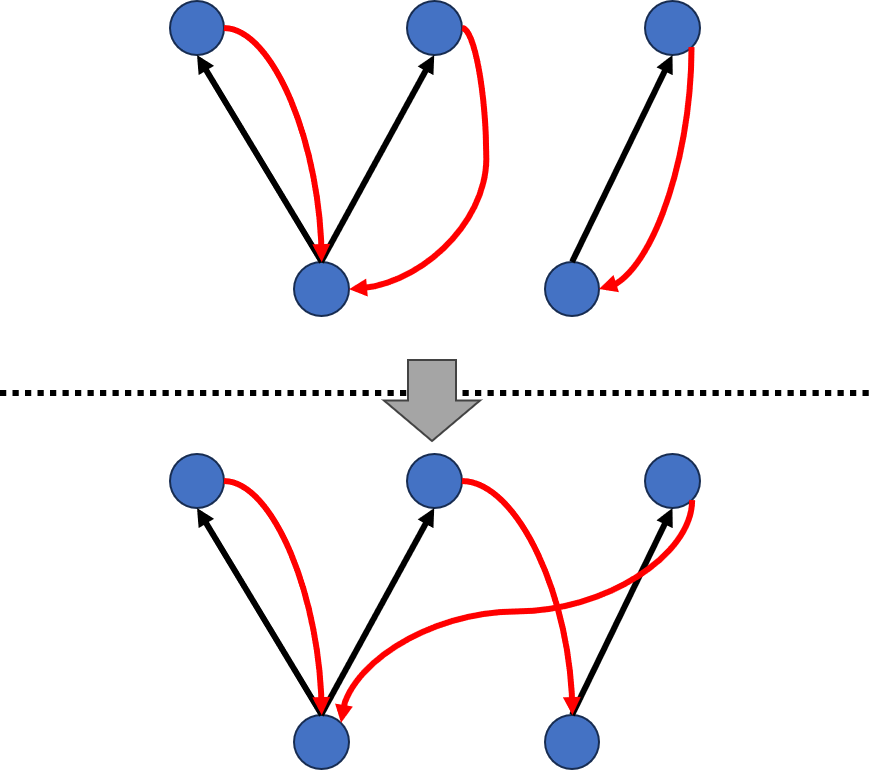

+++
title = "POJ 1236 Network of Schools(luogu P2746)"
date = 2025-03-04T13:53:19+09:00
tags = ['競技プログラミング', '蟻本練習問題']
+++

http://poj.org/problem?id=1236
https://www.luogu.com.cn/problem/P2746

https://vjudge.net/problem/POJ-1236
https://vjudge.net/problem/%E6%B4%9B%E8%B0%B7-P2746
<!--more-->
## 問題概要
- 学校が$N$校あり、コンピュータネットワークで接続されている。
- 各学校から、その学校からデータを送れる学校のリストが与えられる。（有向グラフの隣接リスト表現）

- 以下2つの値を出力
	1.  ネットワーク内のすべての学校にソフトウェアが届くようにするには、最低何校に送ればいいか
	2. どの1校からスタートしてもすべての学校にソフトウェアが届くようにするには、最低いくつ有向辺を追加すればいいか

### 制約
- $2\leq N\leq100$
## 解法メモ
### １つ目の値
- SCCして作ったDAGの入次数０の頂点数を答えればよい
### ２つ目の値

- いくつか有向辺を追加し、全ての頂点が1つの強連結成分に入るようにしたい。
- 与えられたグラフの同じ連結成分内の頂点を区別する必要ないので、SCCして作ったDAGの構造を考える。

- DAGの頂点数が1の場合の答えは0になる。以降、頂点数は2以上とする。

- まず、答えの自明な下界を考える。
	- 各入次数0の頂点について考えると、元のグラフでその頂点以外の場所が始点だった場合、絶対にそこにはたどり着けない。
	- 従って、それらの頂点を終点とする辺が少なくとも1つずつ存在する。
	- 各出次数0の頂点について考えると、そこが始点だった場合他の頂点へのルートが存在しない。従って、辺追加後にはそれらの頂点を支店とする辺が少なくとも1つずつ存在する。
	- 以上より、答えは$\max(入次数0の頂点数, 出次数0の頂点数)$以上であることが分かる。

- 実際、出次数0の各頂点から入次数0の各頂点に向かって辺を伸ばすといくつかのループができるような形になり、適当に繋ぎ変えることで1つの強連結成分にまとめることができる


## 実装例
SCCしてできるDAGを返す関数を作っておくと便利
```cpp
#include <algorithm>
#include <cassert>
#include <iostream>
#include <vector>
#define rep(i, n) for (int i = 0, i##_len = (n); i < i##_len; ++i)
using namespace std;

struct SCC {
   private:
    int v;
    vector<vector<int> > G;
    vector<vector<int> > rG;
    vector<int> vs;
    vector<bool> used;
    bool built;

    void dfs(int u) {
        used[u] = true;
        // for (int to : G[u]) {
        for (int i = 0; i < G[u].size(); ++i) {
            int to = G[u][i];
            if (!used[to]) {
                dfs(to);
            }
        }
        vs.push_back(u);
    }

    void rdfs(int u, int k) {
        used[u] = true;
        _component[u] = k;
        for (int i = 0; i < rG[u].size(); ++i) {
            int to = rG[u][i];
            if (!used[to]) rdfs(to, k);
        }
    }

    vector<vector<int> > _scc;
    vector<int> _component;
    vector<vector<int> > _dag;

   public:
    void add_edge(int from, int to) {
        G[from].push_back(to);
        rG[to].push_back(from);
    }

    SCC(int v) : v(v), built(false) {
        G = vector<vector<int> >(v);
        rG = vector<vector<int> >(v);
        used = vector<bool>(v);
        _component = vector<int>(v);
    }

    void build() {
        if (built) return;
        fill(used.begin(), used.end(), false);
        vs.clear();
        for (int u = 0; u < v; ++u)
            if (!used[u]) dfs(u);
        fill(used.begin(), used.end(), false);
        int k = 0;
        for (int i = int(vs.size() - 1); i >= 0; --i)
            if (!used[vs[i]]) rdfs(vs[i], k++);
        _scc = vector<vector<int> >(k);
        for (int u = 0; u < v; ++u) _scc[_component[u]].push_back(u);
        vector<pair<int, int> > edges;
        for (int u = 0; u < v; ++u)
            // for (int to : G[u])
            for (int i = 0; i < G[u].size(); ++i) {
                int to = G[u][i];
                if (_component[u] != _component[to]) edges.push_back(make_pair(_component[u], _component[to]));
            }
        sort(edges.begin(), edges.end());
        edges.erase(unique(edges.begin(), edges.end()), edges.end());
        _dag = vector<vector<int> >(k);
        // for (auto [from, to] : edges) _dag[from].push_back(to);
        for (int i = 0; i < edges.size(); ++i) {
            int from = edges[i].first;
            int to = edges[i].second;
            _dag[from].push_back(to);
        }
        built = true;
    }
    vector<vector<int> > scc() const {
        assert(built);
        return _scc;
    }
    vector<int> component() const {
        assert(built);
        return _component;
    }
    vector<vector<int> > dag() const {
        assert(built);
        return _dag;
    }
};

int main() {
    ios_base::sync_with_stdio(false);
    cin.tie(NULL);
    int n;
    cin >> n;
    SCC scc(n);
    rep(i, n) {
        int to;
        while (true) {
            cin >> to;
            if (to == 0) break;
            scc.add_edge(i, to - 1);
        }
    }
    scc.build();
    vector<vector<int> > dag = scc.dag();
    int k = dag.size();

    vector<int> in(k), out(k);
    rep(from, k) {
        for (int j = 0; j < dag[from].size(); ++j) {
            int to = dag[from][j];
            in[to]++;
            out[from]++;
        }
    }
    int in0 = 0;
    int out0 = 0;
    rep(i, k) {
        if (in[i] == 0) in0++;
        if (out[i] == 0) out0++;
    }
    cout << in0 << '\n';
    if (k != 1) cout << max(in0, out0) << '\n';
    else cout << 0 << '\n';
}
```