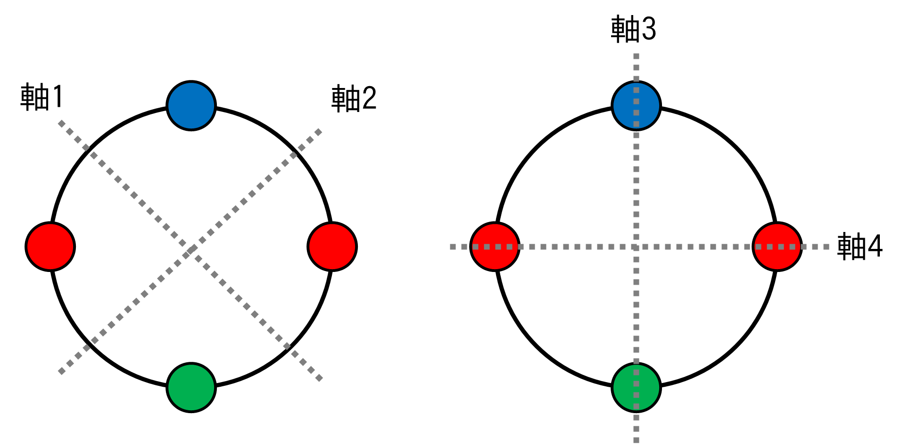
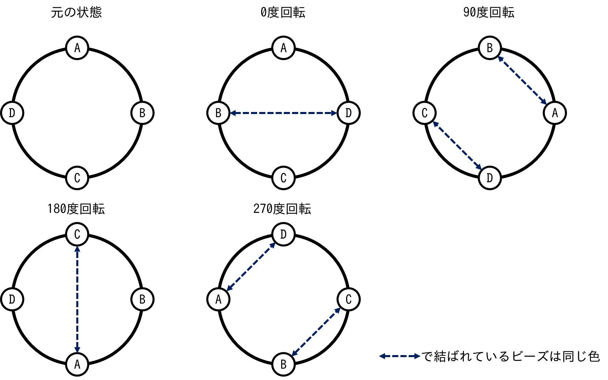

+++
title = "POJ 1286 Necklace of Beads(BOJ 9817, EOlymp 2227)"
date = 2025-03-04T13:53:22+09:00
tags = ['競技プログラミング', '蟻本練習問題']
+++


http://poj.org/problem?id=1286
https://www.acmicpc.net/problem/9817
https://basecamp.eolymp.com/en/problems/2227

https://vjudge.net/problem/POJ-1286
https://vjudge.net/problem/Baekjoon-9817
https://vjudge.net/problem/EOlymp-2227
<!--more-->
## 問題概要
- 赤・青・緑のビーズを合計$N$個繋げた円形のネックレスは、回転・反転等を同一視すると何通りあるか？
### 制約
- $N<24$

※問題文には$N<24$としか書いていないが$N=0$の入力も存在し、その答えは0通りなことに注意
## 解法メモ
ポリアの数え上げ定理を使えばよい。

$N=4$の場合であれば、

- 回転
	- 0度回すと一致：81通り
	- 90度回すと一致：すべて同じ色なので3通り
	- 180度回すと一致：反対側のビーズが同じ色であればいいので9通り
	- 270度回すと一致：1つ分と同じなので3通り
- 反転（軸がビーズの間にある場合)
	- 軸1：9通り
	- 軸2：〃
- 反転（軸がビーズの上にある場合）
	- 軸3：27通り
	- 軸4：〃
でこれらの平均を取れば
$$\dfrac{(81+3+9+3)+(9\times 2)+(27\times 2)}8=21$$
となる。

---
一瞬これで反転あり全パターン列挙できているか不安になったが、「Aが重なるように裏返す→0/90/180/270度回転」の4パターンを列挙できているのでOK


---
一般の場合には、
- 反転なしで$i$個分回転：$3^{\gcd(N, i)}$通り
- $N$が偶数の場合
	- 軸がビーズの間にある場合：$3^{N/2}$通り、軸は$N/2$種類
	- 軸がビーズの上にある場合：$3^{\lfloor (N-1)/2+2 \rfloor}$通り、軸は$N/2$種類
- $N$が奇数の場合
	- 軸がビーズの上にある場合：$3^{\lfloor (N-1)/2+1 \rfloor}$通り、軸は$N$種類
$N$が奇数の場合には軸がビーズの間にある場合がないので場合分けが必要

## 実装例
POJのLanguageでG++を選ぶと通るが、C++だと `'pow' : ambiguous call to overloaded function` でCEになるので注意。
また、C++17以降では `<numeric>` をインクルードするとgcd関数が使え、それ以前でもPOJほど古くないgccでは `__gcd` が使えるのでそちらを使った方が良い
```cpp
#include <cmath>
#include <iostream>
typedef long long ll;
#define rep(i, n) for (ll i = 0, i##_len = (n); i < i##_len; ++i)
using namespace std;

ll gcd(ll a, ll b) {
    if (a < b) return gcd(b, a);
    if (b == 0) return a;
    return gcd(b, a % b);
}

int main() {
    while (true) {
        int n;
        cin >> n;
        if (n == -1) break;
        if (n == 0) {
            cout << 0 << '\n';
            continue;
        }
        ll sum = 0, cnt = 0;
        rep(i, n) {
            sum += pow(3, gcd(n, i));
            cnt++;
        }
        if (n % 2 == 0) {
            sum += pow(3, n / 2) * (n / 2);
            cnt += n / 2;
            sum += pow(3, (n - 1) / 2 + 2) * (n / 2);
            cnt += n / 2;
        } else {
            sum += pow(3, (n - 1) / 2 + 1) * n;
            cnt += n;
        }
        cout << sum / cnt << '\n';
    }
    return 0;
}
```