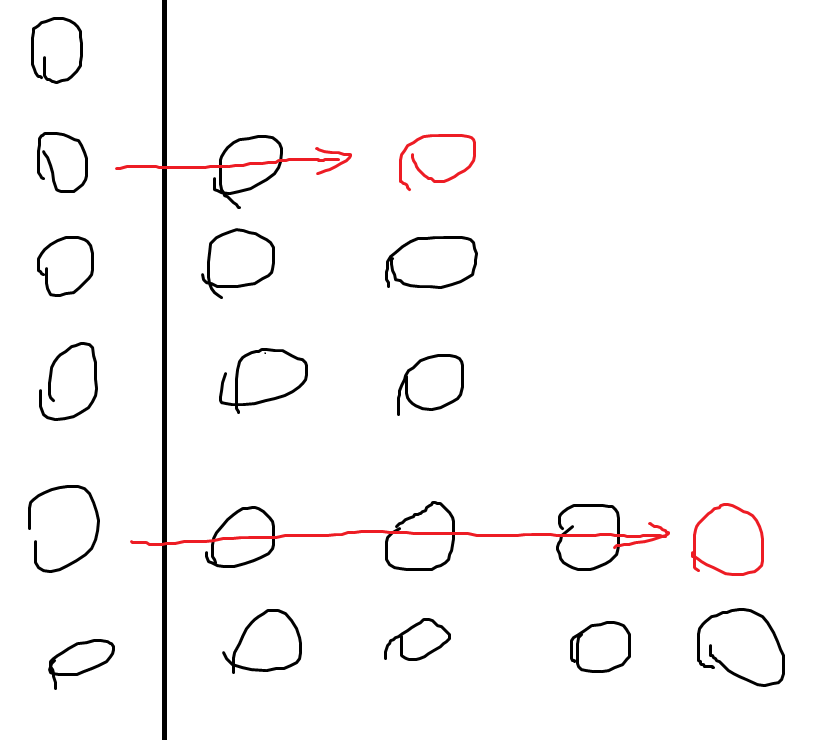

+++
title = "POJ 1740 A New Stone Game"
date = 2025-03-04T13:53:25+09:00
tags = ['競技プログラミング', '蟻本練習問題']
+++

http://poj.org/problem?id=1740

https://vjudge.net/problem/POJ-1740
<!--more-->
## 問題概要

- AliceとBobがゲームを行う。Aliceから交互に手番が回る。
- 山が$N$個あり、各山には$A_i$個石がある。
- 各手番で、プレイヤーは
	1. 山を1つ選ぶ
	2. その山から1つ以上石を取り除く
	3. その山に残った石を好きな山に移動する。（複数の山にk個ずつ・何もしないなど何でもOK）
- の順に行動し、行動できない時負けになる。Aliceが必勝法を持つか判定せよ

### 制約
- $1\leq N\leq10$
- $A_i\leq 100$
## 解法メモ
- かなり難しかった
- とりあえずかんたんな例から考えていく（順番は関係ないのでソート済みとしている）

- **N=1の場合**
	- 勝ち

- **N=2の場合**
- $A=(1,1)$なら負け
- ↑に持っていける$(1,2以上の数)$は勝ち
- 最適なプレイで↑が出てくるのは$(2,2)$から遷移する時だけで、これは負け
- これを繰り返すと、2要素が一致していれば負け、そうでないなら勝ち

- **N=3の場合**
	- 最大の要素を選んで最小の要素にいくつか分け、残りはすべて取り除くことで必ず「残り2山でそれらが一致している」に持っていけるので勝ち

- **N=4の場合**
	- $(1,1,1,1)$は負け、$(2,1,1,1)$は勝ち、$(2,2,1,1)$は負け、…と書き出してみると、 $(1,1,5,5)$や$(2,2,3,3), (7, 7, 7, 7)$のように、同じ要素のペアが2つできる場合は負け、そうでない場合は必ず1手でその状態にできるため勝ちであることがわかる

- **それ以上の場合**
	- 以上のように、「$N$が奇数なら勝ち、偶数の場合は同じ要素のペア$N/2$個が作れれば負け、そうでないなら勝ち」となる
	- Nが奇数の状態から常にペアが作れることは、次のような図を考えるとわかりやすいと思う
		- $(6,5,4,2,1)$の6の山を選んで石を左にスライドさせると$(5,5,2,2)$にすることができる
	- ペアができている状態からペアができている状態にできないことは簡単で、どの山から取っても必ずあるペアが壊れてしまう
	
## 実装例
```cpp
#include <algorithm>
#include <iostream>
#include <vector>
#define rep(i, n) for (int i = 0, i##_len = (n); i < i##_len; ++i)
using namespace std;
#define all(v) v.begin(), v.end()

int main() {
    while (true) {
        int n;
        cin >> n;
        if (n == 0) break;
        vector<int> a(n);
        rep(i, n) cin >> a[i];

        if (n % 2 != 0) {
            cout << 1 << endl;
        } else {
            sort(all(a));
            bool lose = true;
            rep(i, n) {
                if (i % 2 == 0) continue;
                if (a[i] != a[i - 1]) {
                    lose = false;
                    break;
                }
            }
            cout << (lose ? 0 : 1) << endl;
        }
    }
}
```