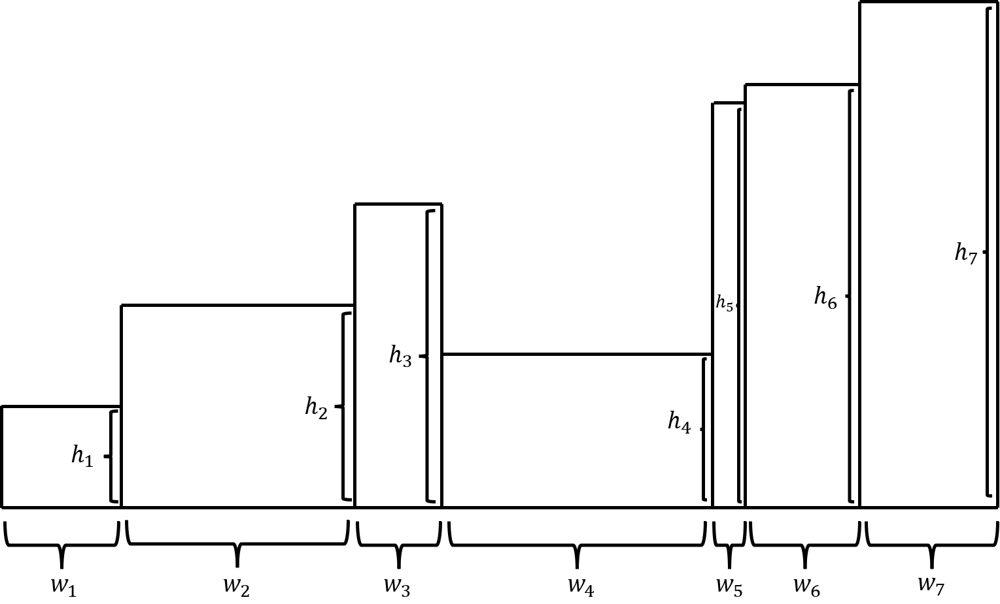
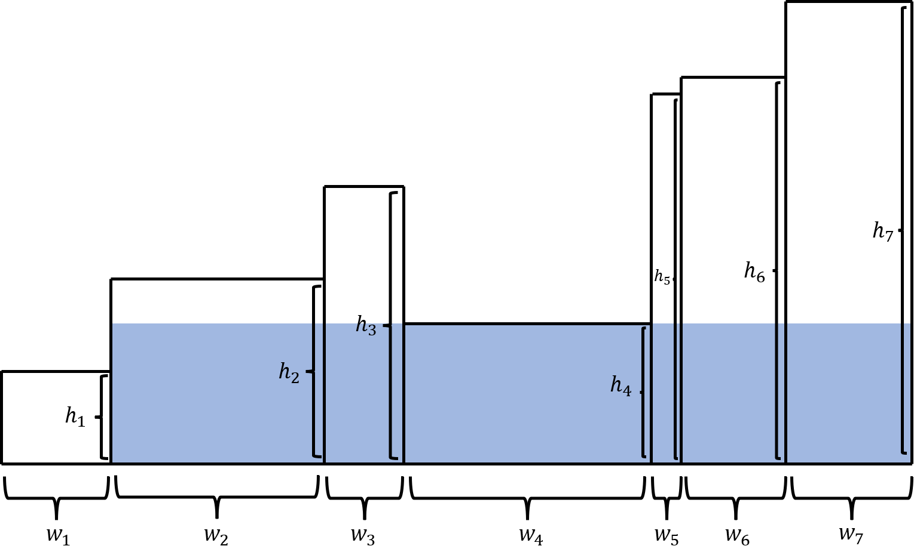

+++
title = "POJ 2082 Terrible Sets"
date = 2025-03-04T13:53:35+09:00
tags = ['競技プログラミング', '蟻本練習問題']
+++

http://poj.org/problem?id=2082

https://vjudge.net/problem/POJ-2082

問題文の読解がまず難しい
<!--more-->
## 問題概要
- 長さ$N$の非負整数列$w_i,h_i$が与えられる。集合$B,S$を以下のように定義する時、$\max(S)$を求めよ。ただし、$w_0=0$とする。
$$B = \{ \langle x, y \rangle \mid x, y \in R \text{ and there exists an index } i > 0 \text{ such that } 0 \leq y \leq h_i, \sum_{0 \leq j \leq i-1} w_j \leq x \leq \sum_{0 \leq j \leq i} w_j \}$$
$$S = \{ A \mid A = WH \text{ for some } W, H \in R^+ \text{ and there exists } x_0, y_0 \in N \text{ such that the set } T = \{ \langle x, y \rangle \mid x, y \in R \text{ and } x_0 \leq x \leq x_0 + W \text{ and } y_0 \leq y \leq y_0 + H \} \text{ is contained in set } B \}$$

式が難しいが、以下のように長方形が並んでいるので、最大の長方形領域の面積を求めればいい。

この場合、（目分量で作った図なので多分だが）青く示した領域になる。

### 制約
- $1\leq N\leq 5\times 10^4$
- $w_1h_1+w_2h_2+\cdots+w_nh_n<10^9$

## 解法メモ

ヒストグラム内最大長方形問題を解くときに、幅情報を累積和で管理すればよい。


## 実装例
```cpp
#include <iostream>
#include <vector>
typedef long long ll;
#define reps(i, n) for (int i = 1, i##_len = (n); i <= i##_len; ++i)
using namespace std;

// ヒストグラムを与えると、h[i]を左右にどこまで伸ばせるか（閉区間）を返す
template <typename T>
vector<pair<int, int> > largest_rectangle_in_histogram(vector<T> &h) {
    const int n = h.size();
    vector<pair<int, int> > res(n);
    vector<int> st;
    for (int i = 0; i < n; ++i) {
        while (!st.empty() && h[st.back()] >= h[i]) st.pop_back();
        res[i].first = st.empty() ? 0 : st.back() + 1;
        st.push_back(i);
    }
    st.clear();
    for (int i = n - 1; i >= 0; --i) {
        while (!st.empty() && h[st.back()] >= h[i]) st.pop_back();
        res[i].second = st.empty() ? n - 1 : st.back() - 1;
        st.push_back(i);
    }
    return res;
}

int main() {
    ios_base::sync_with_stdio(false);
    cin.tie(NULL);
    while (true) {
        int n;
        cin >> n;
        if (n == -1) break;

        vector<ll> w(n + 1), h(n + 1);
        reps(i, n) cin >> w[i] >> h[i];

        reps(i, n) w[i] += w[i - 1];
        vector<pair<int, int> > res = largest_rectangle_in_histogram(h);
        ll ans = 0;
        reps(i, n) ans = max(ans, h[i] * (w[res[i].second] - w[res[i].first - 1]));

        cout << ans << "\n";
    }
}
```