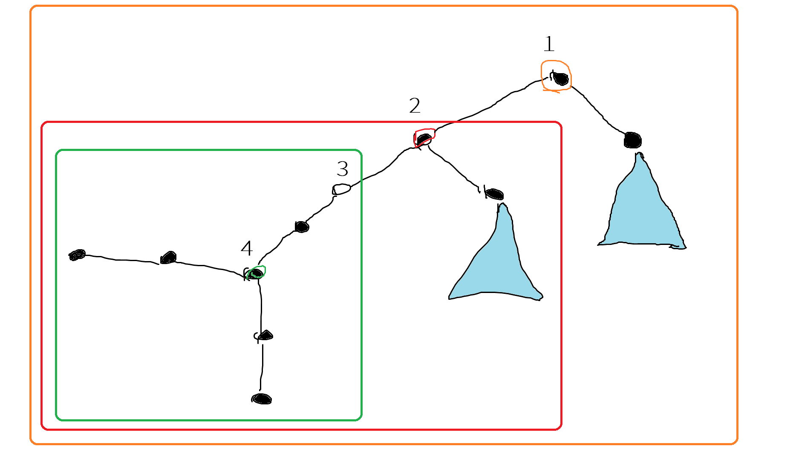

+++
title = "SPOJ QTREE5 Query on a tree V"
date = 2025-03-04T13:54:25+09:00
tags = ['競技プログラミング', '蟻本練習問題']
+++

https://www.spoj.com/problems/QTREE5/en/

https://vjudge.net/problem/SPOJ-QTREE5
<!--more-->
## 問題概要
- $N$頂点の木が与えられる。最初、すべての頂点は黒く塗られている
- $Q$個のクエリに答えよ。クエリは次の2つのいずれか
	- $0\quad i$：$i$番目の頂点を白黒入れ替える
	- $1\quad v$：頂点$v$に最も近い白頂点までの距離を出力する。頂点$v$が白い場合は0、白頂点が存在しない場合は-1
### 制約
- $N\leq 10^5$
- $Q\leq 10^5$

## 解法メモ
- 最も近い白頂点までの距離を高速に求めたい
- 重心分解して得られる木を考えた時、自分が重心になるところから上に辿っていき、重心からの各頂点の距離をmultiset、削除可能ヒープ等に入れて見ればよい

- 例えば、以下のように重心分解できた場合にクエリ(1,4)が来た場合、以下の3つの値のminを取ればよい
	- 4番頂点を根とする最も内側の木（緑部）の、（根から4番頂点までの距離）＋（根から最も近い白頂点までの深さ）=0+2=2
	- 2番頂点を根とする木（赤部）の、（根から4番頂点までの距離）＋（根から最も近い白頂点までの深さ）=3+1=4
	- 1番頂点を根とする木（橙部）の、（根から4番頂点までの距離）＋（根から最も近い白頂点までの深さ）=4+2=6
- 同じ部分木の方向を見てしまっている場合でもうまくいくのは嬉しい



## 実装例
SPOJはC++14が使えるので `std::function` など使える。
この問題を解くとき、重心分解クラスに重心の親子関係を表すtreeとtree_parentを追加した。

最初、距離の管理をmultisetで行ったがTLEしたので、削除可能ヒープ（ヒープを2本持つやつ）を使って通した。コメントアウトしている部分がmultiset実装でアスタリスクのついている行が削除可能ヒープの実装。速いジャッジならmultisetでも動くと思う。
```cpp
#include <algorithm>
#include <cstdio>
#include <functional>
#include <iostream>
#include <map>
#include <queue>
// #include <set>
#include <vector>
#define rep(i, n) for (int i = 0; i < (int)(n); ++i)
constexpr int inf = 1e9;
using namespace std;

template <typename EDGE>
struct CentroidDecomposition {
    using F = std::function<void(int, const vector<bool> &, const vector<vector<EDGE>> &)>;
    const vector<vector<EDGE>> &G;
    vector<bool> centroid;
    vector<int> subtree_size;

    vector<int> tree_parent;
    vector<vector<int>> tree;
    F f;

    CentroidDecomposition(const vector<vector<EDGE>> &_G, F _f)
        : G(_G),
          centroid(_G.size()),
          subtree_size(_G.size()),
          tree_parent(_G.size(), -1),
          tree(_G.size()),
          f(_f) {}

    void add_edge(int u, int v) {
        G[u].push_back(v);
        G[v].push_back(u);
    }

    void solve() { solve(0, 1, -1); }

   private:
    void compute_subtree_size(int v, int p) {
        subtree_size[v] = 1;
        for (size_t i = 0; i < G[v].size(); ++i) {
            const EDGE &e = G[v][i];
            if (e.to == p || centroid[e.to]) continue;
            compute_subtree_size(e.to, v);
            subtree_size[v] += subtree_size[e.to];
        }
    }
    pair<int, int> search_centroid(int v, int p, int t) {
        pair<int, int> res = make_pair<int, int>(G.size(), G.size());
        int sum = 1, m = 0;
        for (size_t i = 0; i < G[v].size(); ++i) {
            const EDGE &e = G[v][i];
            if (e.to == p || centroid[e.to]) continue;
            res = min(res, search_centroid(e.to, v, t));
            m = max(m, subtree_size[e.to]);
            sum += subtree_size[e.to];
        }
        m = max(m, t - sum);
        return min(res, make_pair(m, v));
    }
    void solve(int v, int d, int p) {
        compute_subtree_size(v, -1);
        int s = search_centroid(v, -1, subtree_size[v]).second;
        tree_parent[s] = p;
        if (p != -1) tree[p].push_back(s);
        centroid[s] = d;
        for (size_t i = 0; i < G[s].size(); ++i) {
            if (centroid[G[s][i].to]) continue;
            solve(G[s][i].to, d + 1, s);
        }
        f(s, centroid, G);
        centroid[s] = false;
    }
};

struct edge {
    int to;
    edge(int _to) : to(_to) {}
};

int main() {
    ios_base::sync_with_stdio(false);
    cin.tie(NULL);
    int n;
    cin >> n;
    vector<vector<edge>> G(n);
    rep(i, n - 1) {
        int u, v;
        cin >> u >> v;
        u--, v--;
        G[u].emplace_back(v);
        G[v].emplace_back(u);
    }

    vector<map<int, int>> depths(n);  // depths[i][j] = 頂点iを根とする部分木における頂点jの深さ
    auto f = [&](int c, const vector<bool> &centroid, const vector<vector<edge>> &g) -> void {
        auto dfs = [&](auto dfs, int v, int p = -1, int d = 0) -> void {
            depths[c][v] = d;
            for (const auto &e : g.at(v)) {
                if (e.to == p) continue;
                if (centroid[e.to]) continue;
                dfs(dfs, e.to, v, d + 1);
            }
        };
        dfs(dfs, c);
    };

    CentroidDecomposition<edge> cd(G, f);
    cd.solve();

    // multisetだとTLEするのでpriority_queue2本で削除可能なやつを実装
    // vector<multiset<int>> dist(n);  // dist[i] = 頂点iを根とする部分木に存在する白頂点の深さ // *
    vector<priority_queue<int, vector<int>, greater<int>>> pq1(n);
    vector<priority_queue<int, vector<int>, greater<int>>> pq2(n);
    auto insert = [&](int i, int x) -> void { pq1[i].push(x); };
    auto erase = [&](int i, int x) -> void { pq2[i].push(x); };
    auto get = [&](int i) -> int {
        while (!pq1[i].empty() && !pq2[i].empty() && pq1[i].top() == pq2[i].top()) {
            pq1[i].pop();
            pq2[i].pop();
        }
        return pq1[i].empty() ? inf : pq1[i].top();
    };

    vector<bool> is_white(n, false);
    int q;
    cin >> q;
    rep(i, q) {
        int x, y;
        cin >> x >> y;
        y--;
        if (x == 0) {
            is_white[y] = !is_white[y];

            int cur = y;
            while (cur != -1) {
                if (is_white[y]) {
                    // dist[cur].insert(depths[cur][y]);
                    insert(cur, depths[cur][y]);  // *
                } else {
                    // dist[cur].erase(dist[cur].find(depths[cur][y]));
                    erase(cur, depths[cur][y]);  // *
                }
                cur = cd.tree_parent[cur];
            }
        } else {
            int ans = inf;
            int cur = y;
            while (cur != -1) {
                // if (!dist[cur].empty()) ans = min(ans, depths[cur][y] + *dist[cur].begin());
                int min_dist = get(cur);                                         // *
                if (min_dist != inf) ans = min(ans, depths[cur][y] + min_dist);  // *
                cur = cd.tree_parent[cur];
            }
            if (ans == inf) ans = -1;
            cout << ans << "\n";
        }
    }
}
```